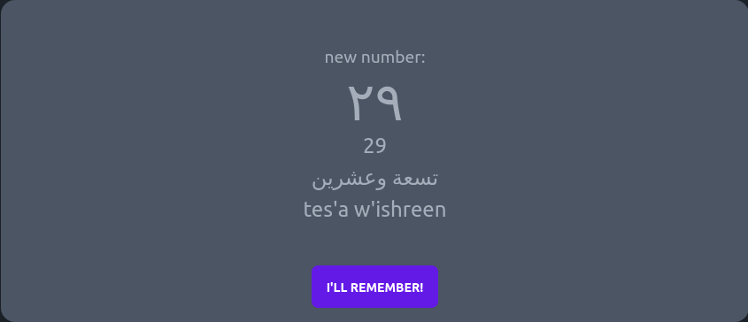

# Arabic Number Tutor

## Purpose / User Stories

- [x] As a learner, I want to gain a firm understanding (read, pronounce, hear, translate) of Arabic numbers
- [x] As a learner, I want to have fun and stay motivated
- [x] As the administrator, I want to gain insights into how Arabic numbers are best practiced/learned

## About

...this is a little tool I built to practice numbers in Arabic. Check it out [here](https://arabic-numbers.koljapluemer.com/). This project is a little game, repeatedly asking single-choice questions. In the background, it employs a Spaced Repetition system, which you can read about [here](https://koljapluemer.com/2023/09/23/arabic-numbers-sr.html).

## Tech Stack

This is made with Vue3. All interesting things are happening in `App.vue`, so feel free to check out the code.