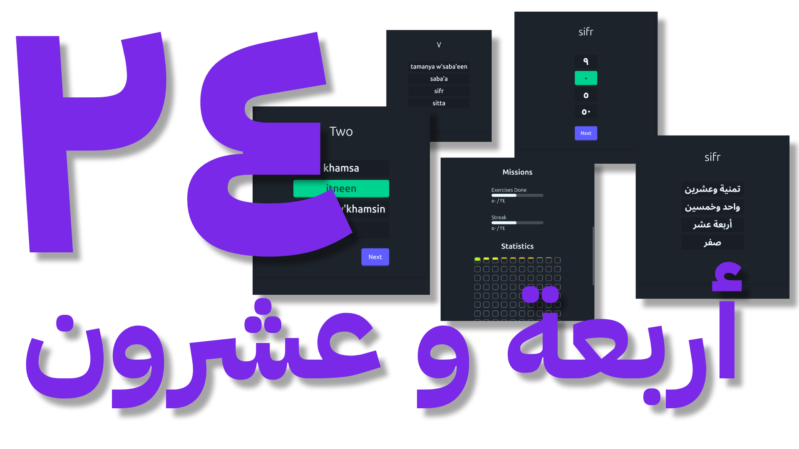

# Arabic Number Tutor

## About

...this is a little tool I built to practice numbers in Arabic.  This project is a little game, repeatedly asking single-choice questions. In the background, it employs a Spaced Repetition system.

